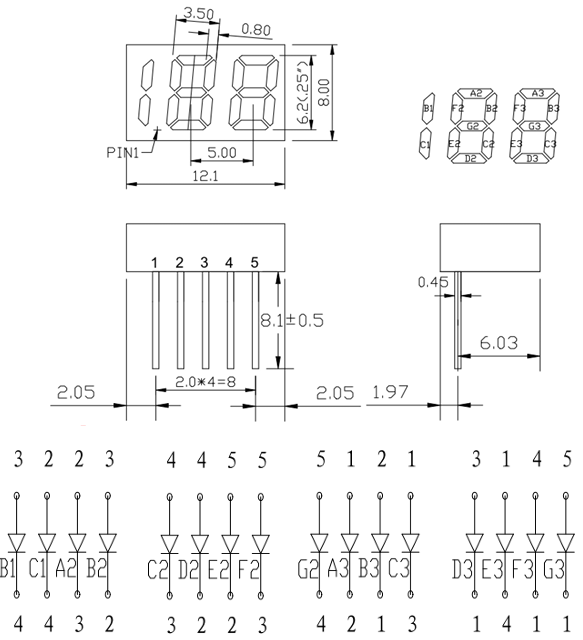

# Segment188

Arduino library for driving the 188-type charlieplexed LED digital segment display. Displays values 0–199 using 5 GPIO pins and no extra driver hardware.

Hardware Setup
--------------
Uses 5 digital pins, charlieplexed — no common ground/anode wiring needed. Each pin needs its own series resistor e.g 100Ω. Avoid pins with a fixed hardware pull-up/pull-down or reserved boot/debug function on your board.

Wire the 5 pins in datasheet order (1–5) and pass them to the constructor in that order, e.g. `Segment188(PA0, PA1, PA2, PA3, PA4)`.

Repository Contents
-------------------
* **/examples** - Arduino example sketches
* **/src**

Documentation

License Information
-------------------
MIT — see [LICENSE](LICENSE).
